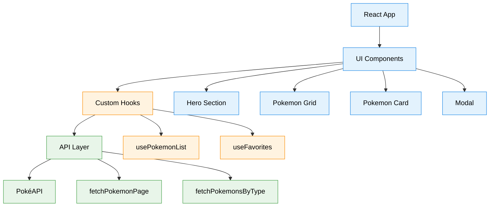
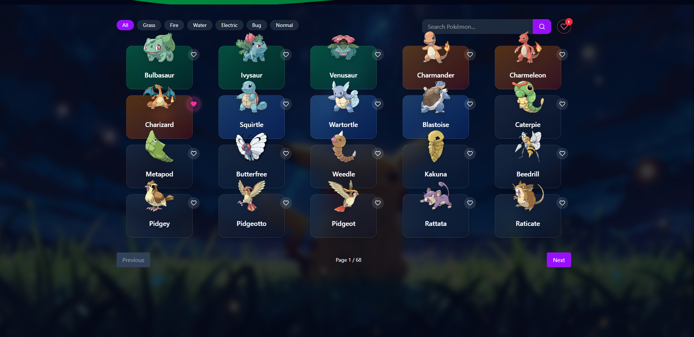
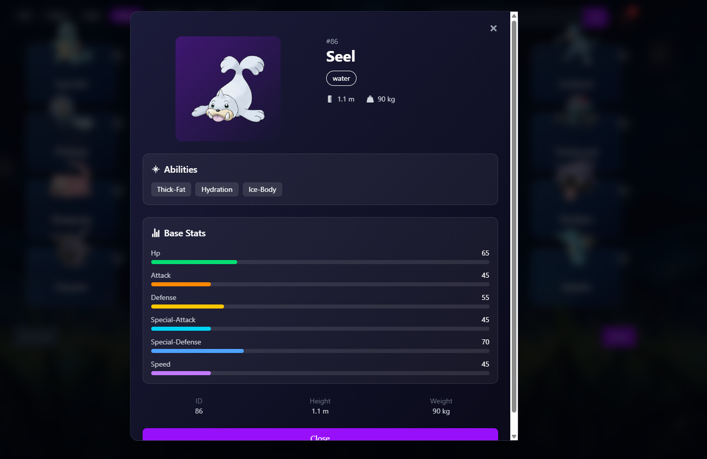
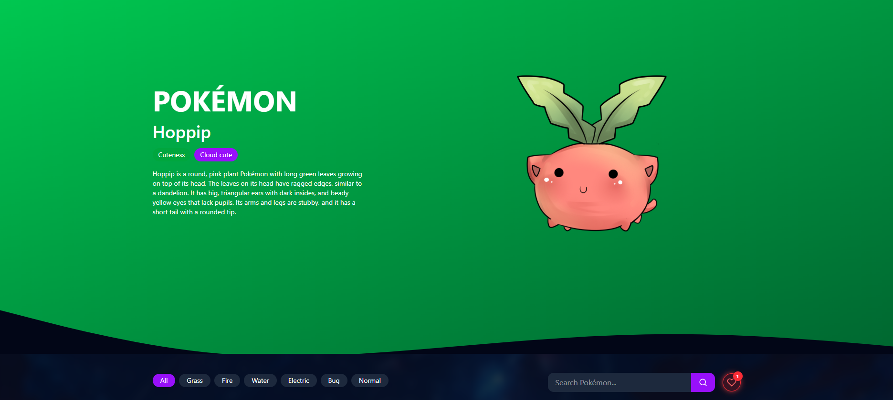

# 🧩 Pokedex Lite

A responsive web application that allows users to explore Pokémon data using the PokéAPI.
Users can search, filter, paginate, and save their favorite Pokémon with a smooth and interactive UI.

---

## 🚀 Live Demo

https://pokedex-lite-sigma-pearl.vercel.app

---

## ✨ Features

### 🔹 Core Features

* 📦 Fetch Pokémon data from API
* 🔍 Search Pokémon by name
* 🧪 Filter Pokémon by type
* 📄 Pagination (Next / Previous)
* ❤️ Add/Remove Favorites (persisted in localStorage)
* 📊 Detailed Pokémon Modal (stats, abilities, height, weight)
* ⚠️ Error handling + loading states

### 🎨 UI/UX Enhancements

* ✨ Smooth animations using Framer Motion
* 💫 Floating Pokémon effects
* 🔔 Toast notifications for user actions
* 📱 Fully responsive (mobile, tablet, desktop)

---

## 🛠️ Tech Stack

* **Frontend:** React (Vite)
* **Styling:** Tailwind CSS
* **Animations:** Framer Motion
* **Notifications:** react-hot-toast
* **API:** PokéAPI
* **Deployment:** Vercel

---

## 📁 Project Structure

```
src/
├── components/
├── hooks/
├── services/
├── pages/
├── utils/
├── assets/
```

---

## ⚙️ Installation & Setup

### 1. Clone the repository

```bash
https://github.com/logicscienc/Pokedex-Lite
cd Pokedex-Lite
```

### 2. Install dependencies

```bash
npm install
```

### 3. Run development server

```bash
npm run dev
```

### 4. Build for production

```bash
npm run build
```

---

## 🧠 Architecture Diagram



---

## 📸 Screenshots





## ⚔️ Challenges Faced & How I solved them

* Handling Pagination with Filtering: When filtering Pokemon by type, the API returns a full list without built-in pagination like the main endpoint.
Ans> I handled pagination manually by slicing the filtered results on the frontend. I maintained offset and limit state and applied them after fetching the type-based data. This kept the behavior consistent with normal pagination.
* Managing Multiple API Calls Efficiently : The main Pokémon list API only returns basic info, so I had to fetch details for each Pokémon separately, which can lead to multiple API calls and slow loading.
Ans> I used Promise.all() to fetch all Pokémon details in parallel instead of sequentially. This significantly improved loading performance and ensured the UI renders faster.
* Avoiding Unnecessary Re-renders with Favorites : When working with favorites stored in localStorage, there was a risk of overwriting data on initial load or causing extra re-renders.
Ans> I introduced a loaded state to ensure localStorage is read first before writing to it. This prevented accidental overwrites and made the state flow more predictable.
* UI State Handling (Loading, Empty, Error) : Managing different UI states like loading, no results, and API errors without cluttering the UI logic.
Ans> I separated conditions clearly and handled each state independently (loader, empty message, error message). This made the UI more predictable and easier to maintain.
* Keeping Components Reusable and Clean : As the app grew, it was easy for components to become too complex or tightly coupled.
Ans> I separated logic into custom hooks (usePokemonList, useFavorites) and kept components focused on UI. This improved readability and made the codebase more scalable.
* Smooth Animations Without Affecting Performance : Adding animations without making the UI feel slow or overwhelming.
Ans> I used Framer Motion for lightweight animations and kept them subtle (hover effects, fade-ins, floating elements) to enhance UX without impacting performance.

---


## 💡 Improvements (Future Scope)

* Add OAuth authentication (Google/GitHub)
* Add skeleton loaders
* Improve accessibility (ARIA roles)
* Add more Pokémon types filtering

---

## 📌 Conclusion

This project focuses on building a clean, scalable frontend architecture with strong UI/UX and efficient state management.

---

